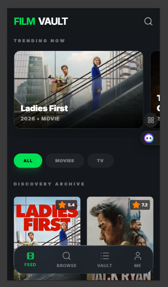
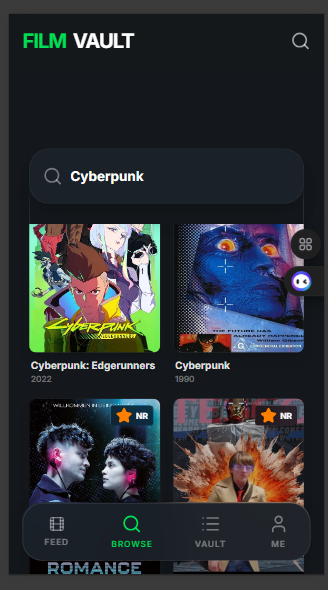
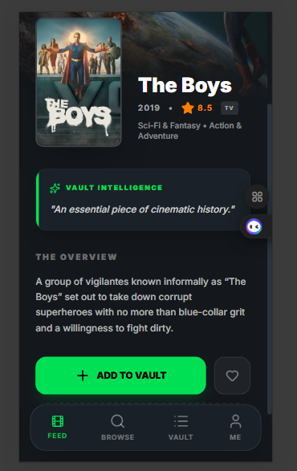
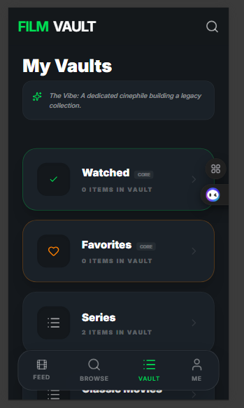
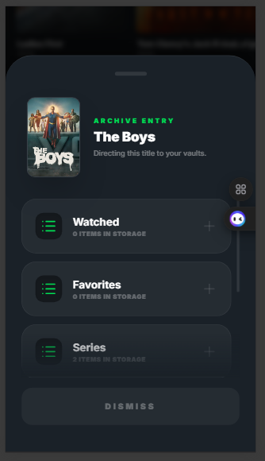
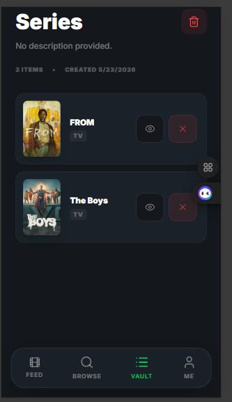
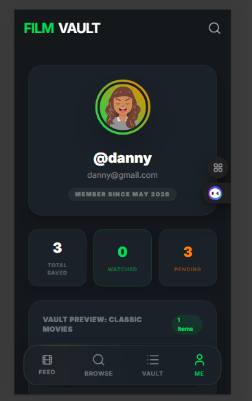

# 🎬 FilmVault

> A sleek, high-fidelity movie watchlist and AI-enhanced cinematic tracking system built on Next.js, Zustand, and MongoDB Atlas.

---

## 📌 Project Overview

**FilmVault** is a premium, full-stack web application designed for passionate cinephiles. It enables users to curate custom movie vaults, track their viewing history, and receive tailored AI-powered insights for their collections. 

Built as a robust, real-world engineering project, FilmVault demonstrates how to integrate modern React state orchestration with scalable serverless Next.js API endpoints, a cloud-backed MongoDB database, and generative AI features. It serves as both a practical utility and a showcase of clean, modular full-stack architecture.

---

## 📷 Application Preview

### 1. Home Screen


### 2. Search Experience


### 3. Movie Details View


### 4. Watchlist Overview


### 5. Add to Watchlist Flow


### 6. Watchlist Items View


### 7. Profile Dashboard


---

## 🚀 Key Features

* **Secure Authentication:** User accounts with encrypted password hashing (via `bcryptjs`), JSON Web Token authentication sessions (JWT), and automated token preservation across client page reloads.
* **Intelligent Discovery Engine:** Instant, real-time movie and TV show search powered by the official **TMDB API**, with fully paginated trending feeds.
* **Advanced Vault Curation:** Create, customize, and manage personal movie lists (Vaults). Mark films as seen to dynamically transfer them to the system-protected "Already Watched" catalog.
* **AI-Powered "Hot Takes":** Leverages the **Google Gemini API** (`@google/genai`) to generate instant dynamic cinema insights for individual movies.
* **Automated List "Vibe Check":** Generative AI reads your watchlists to compose a custom, personalized, witty personality review based on the specific films you've saved.
* **Comprehensive Profile Dashboard:** Displays aggregate watching stats (total movies watched, vault counts) with dynamic user profile personalization.

---

## 🛠️ Tech Stack

### Frontend
* **Core:** Next.js 16 (App Router), React 18, TypeScript
* **State Management:** Zustand (custom persistent state orchestrator)
* **Styling:** Vanilla CSS (Tailwind CSS 3/4 styling tokens)
* **Iconography:** Lucide React

### Backend & Database
* **API Layer:** Next.js Serverless API Routes (`app/api/*`)
* **Database Engine:** MongoDB Atlas (Mongoose ODM layer)
* **Encryption & Auth:** `bcryptjs` for secure hashing, `jsonwebtoken` for secure stateless sessions

### External Integrations
* **Cinema Metadata:** The Movie Database (TMDB) API
* **Cognitive Intelligence:** Google Gemini AI API

---

## 🏗️ Architecture Overview

FilmVault follows a clean, decoupled three-layer structure that separates visual representation from state management, business rules, and database operations.

```text
  [ Client UI Layer ] ──> React Components (App.tsx, tabs/*)
                               │
                               ▼
  [ State Management ] ──> Zustand Store (store/useStore.ts)
                               │
                               ▼
  [ Domain Adapters ]  ──> Domain Managers (domain/watchlistManager.ts)
                               │
                               ▼
  [ Service Gateways ] ──> API Clients (services/mongoService.ts)
                               │
                               ▼
  [ Backend API Layer] ──> Next.js Serverless Routes (app/api/*)
                               │
                               ▼
  [ Data Persistence ] ──> Mongoose ODM Layer (lib/mongodb.ts) ──> [ MongoDB Atlas ]
```

### Detailed Execution Flows

#### 1. Authentication Flow
1. User enters credentials on `AuthScreen.tsx`.
2. `useStore` calls `authManager.signUpWithEmail` or `signInWithPassword`.
3. An HTTP `POST` request is dispatched to `/api/auth/signup` or `/api/auth/login`.
4. The server connects to MongoDB, hashes/validates the password, signs a stateless JWT, and returns the session payload.
5. The JWT token is securely cached in local storage for subsequent header authorizations.

#### 2. Watchlist CRUD Flow
1. User adds or removes a title from a specific Vault in the UI.
2. The Zustand store updates local UI states instantly for optimistic rendering.
3. The store dispatches async network calls via `watchlistManager.ts` to `/api/watchlists/[id]/items`.
4. The backend verifies the JWT authentication header, completes the transaction with MongoDB, and returns the updated DB model to sync client-side cache.

#### 3. AI Vibe Check Flow
1. User clicks the "Vibe Check" button inside a specific Vault.
2. The client requests `/api/ai/vibe` with the saved list titles.
3. The API validates the request, packages the titles into a structured prompt, and queries the Gemini API.
4. Gemini's customized response is returned as a JSON text stream to be displayed in a premium glassmorphic overlay.

---

## ⚡ Setup & Installation

Follow these steps to run the Next.js full-stack server locally:

### 1. Clone the Repository
```bash
git clone https://github.com/DanielC34/FilmVault.git
cd FilmVault
```

### 2. Install Dependencies
```bash
npm install
```

### 3. Configure Environment Variables
Create a file named `.env` (or `.env.local`) in the root directory and specify the following configurations:

```env
# Google Gemini API Key
GEMINI_API_KEY=your_gemini_api_key_here

# TMDB API Configuration
NEXT_PUBLIC_TMDB_API_KEY=your_tmdb_api_key_here

# MongoDB Connection Parameters
MONGODB_URI=mongodb+srv://<user>:<password>@cluster.mongodb.net/
DB_NAME=filmvault

# Authentication Secret
JWT_SECRET=your_cryptographically_secure_jwt_secret_key
```

### 4. Run the Development Server
```bash
npm run dev
```
Open **[http://localhost:3000](http://localhost:3000)** in your browser to access the active FilmVault.

### 5. Build for Production
To build, bundle, and optimize the application for a cloud deployment (e.g., Vercel):
```bash
npm run build
npm start
```

---

## 🔑 Environment Variables Reference

| Variable Name | Required | Description |
| --- | --- | --- |
| `GEMINI_API_KEY` | **Yes** | Authenticates queries sent to Google's generative models for "Hot Takes" and list "Vibe Checks". |
| `NEXT_PUBLIC_TMDB_API_KEY` | **Yes** | Public-facing client-side key used to query movie and show metadata directly from the TMDB API. |
| `MONGODB_URI` | **Yes** | Connection string for the cloud-backed MongoDB Atlas cluster. |
| `DB_NAME` | **No** | Target collection name in the MongoDB cluster (Defaults to `filmvault`). |
| `JWT_SECRET` | **Yes** | Private security token used to sign and verify JSON Web Token sessions for clients. |

---

## 🔮 Future Improvements

While FilmVault is fully working and production-ready, these future enhancements are planned:
* **Advanced Profile Customization:** Adding user profile editing, customizable avatars, and banner uploads.
* **Aggressive Redis Caching:** Adding an server-side Redis caching tier for TMDB movie detail pages to optimize load times and API rate limits.
* **Platform-Wide Native Synchronization:** Expanding the backend server to support and synchronize authentication states natively with the companion React Native Expo mobile app (`/mobile`).
* **Complex Watchlist Analytics:** Visual dashboards on the Profile tab detailing favorite genres, directors, and screen-time history.

---

_“Cinema is a matter of what's in the frame and what's out.” – Martin Scorsese_
